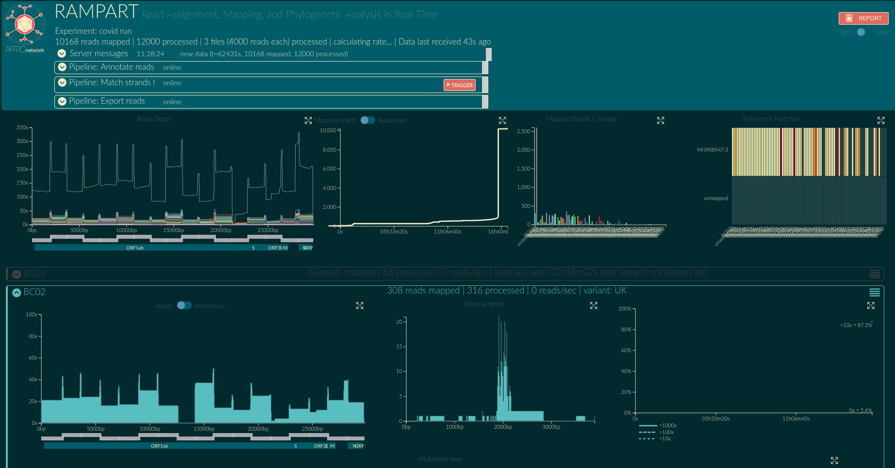

fmfi-compbio/rampart repository ([https://github.com/fmfi-compbio/rampart/tree/SARS-CoV-2_version](https://github.com/fmfi-compbio/rampart/tree/SARS-CoV-2_version)) completely replaced this repository at the point of time it was created, therefore this one is archived and no longer maintained. This repo was a copy of [https://github.com/artic-network/rampart](https://github.com/artic-network/rampart), during SARS-Cov-2 pandemics, introducing some new features for monitoring of SARS-Cov-2 sequencing runs. It was used for a while and then abanodoned due to lack of time and my bachelor's thesis work on something similar, see [https://github.com/fmfi-compbio/pande-mic](https://github.com/fmfi-compbio/pande-mic) and [https://github.com/fmfi-compbio/pande-mic-dashboard](https://github.com/fmfi-compbio/pande-mic-dashboard). 

# RAMPART
Read Assignment, Mapping, and Phylogenetic Analysis in Real Time.

RAMPART runs concurrently with MinKNOW and shows you demuxing / mapping results in real time.

## Motivation
Time is crucial in outbreak analysis, and recent advancements in sequencing prep now mean that sequencing is the bottleneck for many pathogens.
Furthermore, the small size of many pathogens mean that insightful sequence data is obtained in a matter of minutes.
RAMPART run concurrently with MinION sequencing of such pathogens.
It provides a real-time overview of genome coverage and reference matching for each barcode.

## Documentation

* [Installation](docs/installation.md) <!-- * [Running an example dataset & understanding the visualisations](docs/examples.md) -->
* [Setting up for your own run](docs/setting-up.md)
* [Configuring RAMPART using protocols](docs/protocols.md)
* [Covid strand matching pipeline](docs/barcode_strand_match.md)

